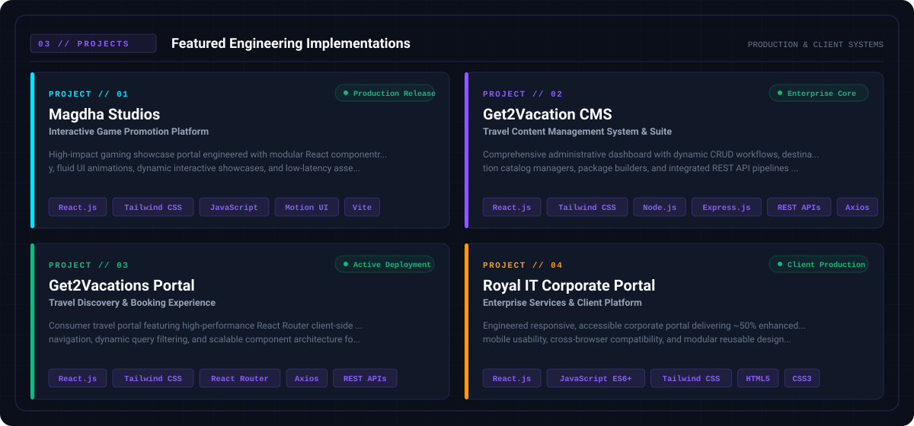
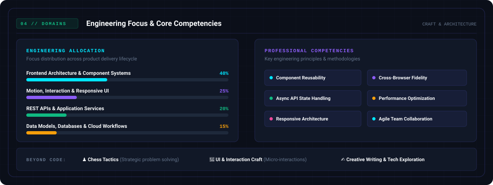
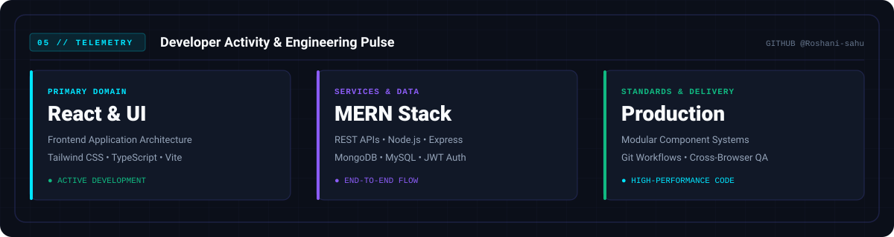

<!-- ================================================================= -->
<!-- 01 — HERO HEADER: ROSHANI SAHU                                    -->
<!-- ================================================================= -->
<picture>
  <source media="(prefers-color-scheme: dark)" srcset="./assets/hero/hero-dark.svg">
  <source media="(prefers-color-scheme: light)" srcset="./assets/hero/hero-light.svg">
  
</picture>

  

<!-- ================================================================= -->
<!-- 02 — ENGINEERING STACK & COMPONENT ARCHITECTURE                   -->
<!-- ================================================================= -->
<picture>
  <source media="(prefers-color-scheme: dark)" srcset="./assets/stack/stack-flow-dark.svg">
  <source media="(prefers-color-scheme: light)" srcset="./assets/stack/stack-flow-light.svg">
  
</picture>

  

<!-- ================================================================= -->
<!-- 03 — FEATURED PROJECTS SHOWCASE                                   -->
<!-- ================================================================= -->
<picture>
  <source media="(prefers-color-scheme: dark)" srcset="./assets/projects/showcase-dark.svg">
  <source media="(prefers-color-scheme: light)" srcset="./assets/projects/showcase-light.svg">
  
</picture>

  

<!-- ================================================================= -->
<!-- 04 — ENGINEERING FOCUS & CORE COMPETENCIES                        -->
<!-- ================================================================= -->
<picture>
  <source media="(prefers-color-scheme: dark)" srcset="./assets/focus/focus-matrix-dark.svg">
  <source media="(prefers-color-scheme: light)" srcset="./assets/focus/focus-matrix-light.svg">
  
</picture>

  

<!-- ================================================================= -->
<!-- 05 — GITHUB TELEMETRY & ACTIVITY PULSE                            -->
<!-- ================================================================= -->
<picture>
  <source media="(prefers-color-scheme: dark)" srcset="./assets/activity/telemetry-dark.svg">
  <source media="(prefers-color-scheme: light)" srcset="./assets/activity/telemetry-light.svg">
  
</picture>

  

<!-- ================================================================= -->
<!-- 06 — INTERACTIVE CONTACT & CONNECT HUB                            -->
<!-- ================================================================= -->

  <a href="https://github.com/Roshani-sahu" target="_blank" rel="noopener noreferrer">
    <picture>
      <source media="(prefers-color-scheme: dark)" srcset="./assets/footer/btn-github-dark.svg">
      <source media="(prefers-color-scheme: light)" srcset="./assets/footer/btn-github-light.svg">
      
    </picture>
  </a>
  &nbsp;
  <a href="https://www.linkedin.com/in/roshani-sahu-1606b5228" target="_blank" rel="noopener noreferrer">
    <picture>
      <source media="(prefers-color-scheme: dark)" srcset="./assets/footer/btn-linkedin-dark.svg">
      <source media="(prefers-color-scheme: light)" srcset="./assets/footer/btn-linkedin-light.svg">
      
    </picture>
  </a>
  &nbsp;
  <a href="mailto:roshani032003@gmail.com" target="_blank" rel="noopener noreferrer">
    <picture>
      <source media="(prefers-color-scheme: dark)" srcset="./assets/footer/btn-email-dark.svg">
      <source media="(prefers-color-scheme: light)" srcset="./assets/footer/btn-email-light.svg">
      
    </picture>
  </a>

