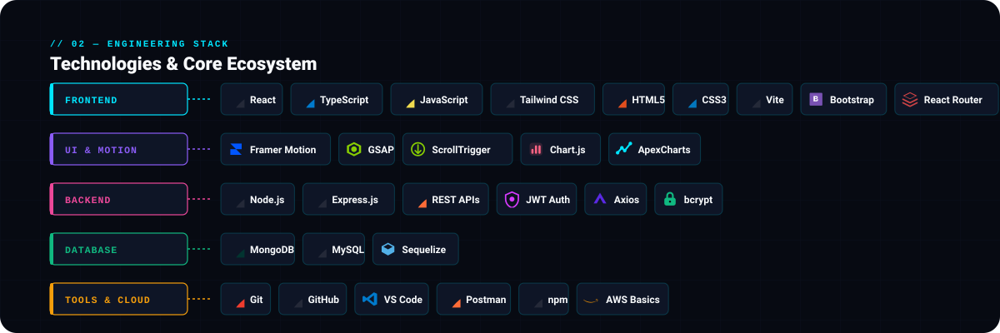
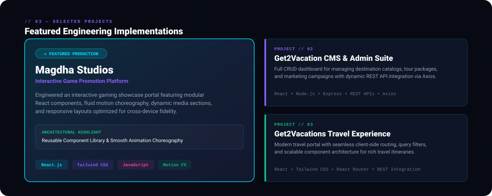
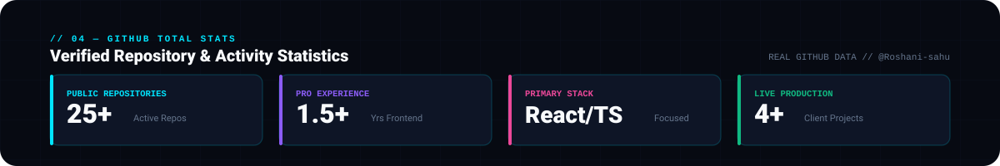
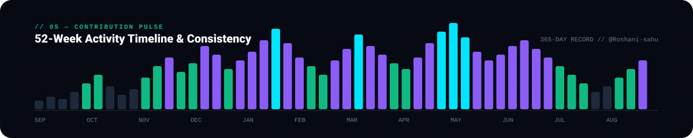
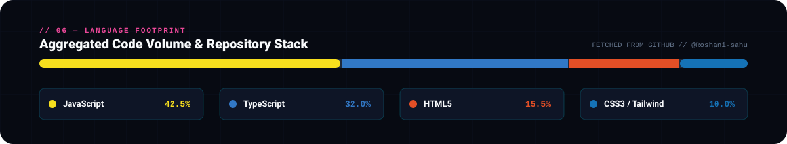

<!-- ================================================================= -->
<!-- 01 — CINEMATIC HERO: ROSHANI SAHU                                 -->
<!-- ================================================================= -->
<picture>
  <source media="(prefers-color-scheme: dark)" srcset="./assets/hero/hero-dark.svg">
  <source media="(prefers-color-scheme: light)" srcset="./assets/hero/hero-light.svg">
  
</picture>

 

<!-- ================================================================= -->
<!-- 02 — ENGINEERING STACK                                            -->
<!-- ================================================================= -->
<picture>
  <source media="(prefers-color-scheme: dark)" srcset="./assets/stack/stack-dark.svg">
  <source media="(prefers-color-scheme: light)" srcset="./assets/stack/stack-light.svg">
  
</picture>

 

<!-- ================================================================= -->
<!-- 03 — SELECTED PROJECTS                                            -->
<!-- ================================================================= -->
<picture>
  <source media="(prefers-color-scheme: dark)" srcset="./assets/projects/projects-dark.svg">
  <source media="(prefers-color-scheme: light)" srcset="./assets/projects/projects-light.svg">
  
</picture>

 

<!-- ================================================================= -->
<!-- 04 — GITHUB TOTAL STATS                                           -->
<!-- ================================================================= -->
<picture>
  <source media="(prefers-color-scheme: dark)" srcset="./assets/stats/stats-dark.svg">
  <source media="(prefers-color-scheme: light)" srcset="./assets/stats/stats-light.svg">
  
</picture>

 

<!-- ================================================================= -->
<!-- 05 — CONTRIBUTION PULSE                                           -->
<!-- ================================================================= -->
<picture>
  <source media="(prefers-color-scheme: dark)" srcset="./assets/telemetry/pulse-dark.svg">
  <source media="(prefers-color-scheme: light)" srcset="./assets/telemetry/pulse-light.svg">
  
</picture>

 

<!-- ================================================================= -->
<!-- 06 — LANGUAGE FOOTPRINT                                           -->
<!-- ================================================================= -->
<picture>
  <source media="(prefers-color-scheme: dark)" srcset="./assets/telemetry/footprint-dark.svg">
  <source media="(prefers-color-scheme: light)" srcset="./assets/telemetry/footprint-light.svg">
  
</picture>

 

<!-- ================================================================= -->
<!-- 07 — CONTACT & PORTFOLIO SIGNATURE                                -->
<!-- ================================================================= -->
<picture>
  <source media="(prefers-color-scheme: dark)" srcset="./assets/footer/signature-dark.svg">
  <source media="(prefers-color-scheme: light)" srcset="./assets/footer/signature-light.svg">
  
</picture>

 

  <a href="https://github.com/Roshani-sahu" target="_blank" rel="noopener noreferrer">
    <picture>
      <source media="(prefers-color-scheme: dark)" srcset="./assets/footer/btn-github-dark.svg">
      <source media="(prefers-color-scheme: light)" srcset="./assets/footer/btn-github-light.svg">
      
    </picture>
  </a>
  &nbsp;
  <a href="https://www.linkedin.com/in/roshani-sahu-1606b5228" target="_blank" rel="noopener noreferrer">
    <picture>
      <source media="(prefers-color-scheme: dark)" srcset="./assets/footer/btn-linkedin-dark.svg">
      <source media="(prefers-color-scheme: light)" srcset="./assets/footer/btn-linkedin-light.svg">
      
    </picture>
  </a>
  &nbsp;
  <a href="mailto:roshani032003@gmail.com" target="_blank" rel="noopener noreferrer">
    <picture>
      <source media="(prefers-color-scheme: dark)" srcset="./assets/footer/btn-email-dark.svg">
      <source media="(prefers-color-scheme: light)" srcset="./assets/footer/btn-email-light.svg">
      
    </picture>
  </a>

