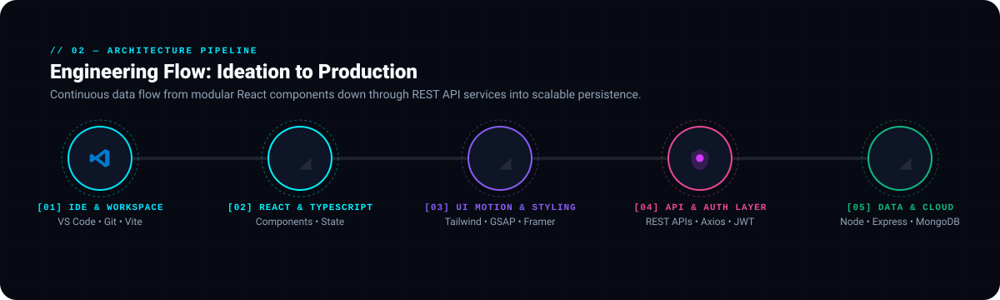
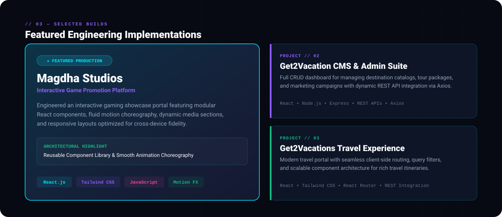
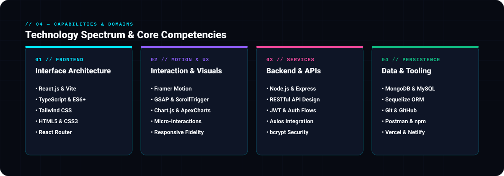
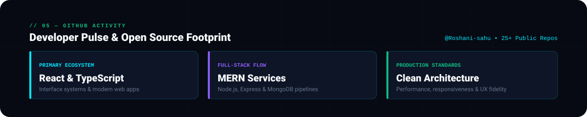
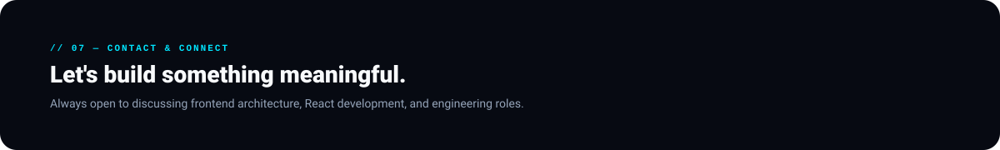
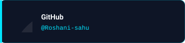
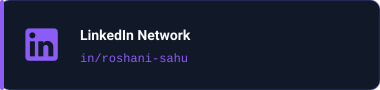
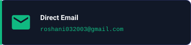

<!-- ================================================================= -->
<!-- 01 — CINEMATIC HERO: ROSHANI SAHU                                 -->
<!-- ================================================================= -->
<picture>
  <source media="(prefers-color-scheme: dark)" srcset="./assets/hero/hero-dark.svg">
  <source media="(prefers-color-scheme: light)" srcset="./assets/hero/hero-light.svg">
  
</picture>

  

<!-- ================================================================= -->
<!-- 02 — ARCHITECTURE & ENGINEERING FLOW                             -->
<!-- ================================================================= -->
<picture>
  <source media="(prefers-color-scheme: dark)" srcset="./assets/flow/flow-dark.svg">
  <source media="(prefers-color-scheme: light)" srcset="./assets/flow/flow-light.svg">
  
</picture>

  

<!-- ================================================================= -->
<!-- 03 — SELECTED BUILDS & PROJECT SHOWCASE                           -->
<!-- ================================================================= -->
<picture>
  <source media="(prefers-color-scheme: dark)" srcset="./assets/projects/builds-dark.svg">
  <source media="(prefers-color-scheme: light)" srcset="./assets/projects/builds-light.svg">
  
</picture>

  

<!-- ================================================================= -->
<!-- 04 — CAPABILITIES & CORE DOMAINS                                  -->
<!-- ================================================================= -->
<picture>
  <source media="(prefers-color-scheme: dark)" srcset="./assets/capabilities/capabilities-dark.svg">
  <source media="(prefers-color-scheme: light)" srcset="./assets/capabilities/capabilities-light.svg">
  
</picture>

  

<!-- ================================================================= -->
<!-- 05 — GITHUB ACTIVITY PULSE                                        -->
<!-- ================================================================= -->
<picture>
  <source media="(prefers-color-scheme: dark)" srcset="./assets/activity/activity-dark.svg">
  <source media="(prefers-color-scheme: light)" srcset="./assets/activity/activity-light.svg">
  
</picture>

  

<!-- ================================================================= -->
<!-- 06 — SIGNATURE & DIRECT CHANNELS                                  -->
<!-- ================================================================= -->
<picture>
  <source media="(prefers-color-scheme: dark)" srcset="./assets/footer/signature-dark.svg">
  <source media="(prefers-color-scheme: light)" srcset="./assets/footer/signature-light.svg">
  
</picture>

 

  <a href="https://github.com/Roshani-sahu" target="_blank" rel="noopener noreferrer">
    <picture>
      <source media="(prefers-color-scheme: dark)" srcset="./assets/footer/btn-github-dark.svg">
      <source media="(prefers-color-scheme: light)" srcset="./assets/footer/btn-github-light.svg">
      
    </picture>
  </a>
  &nbsp;
  <a href="https://www.linkedin.com/in/roshani-sahu-1606b5228" target="_blank" rel="noopener noreferrer">
    <picture>
      <source media="(prefers-color-scheme: dark)" srcset="./assets/footer/btn-linkedin-dark.svg">
      <source media="(prefers-color-scheme: light)" srcset="./assets/footer/btn-linkedin-light.svg">
      
    </picture>
  </a>
  &nbsp;
  <a href="mailto:roshani032003@gmail.com" target="_blank" rel="noopener noreferrer">
    <picture>
      <source media="(prefers-color-scheme: dark)" srcset="./assets/footer/btn-email-dark.svg">
      <source media="(prefers-color-scheme: light)" srcset="./assets/footer/btn-email-light.svg">
      
    </picture>
  </a>

